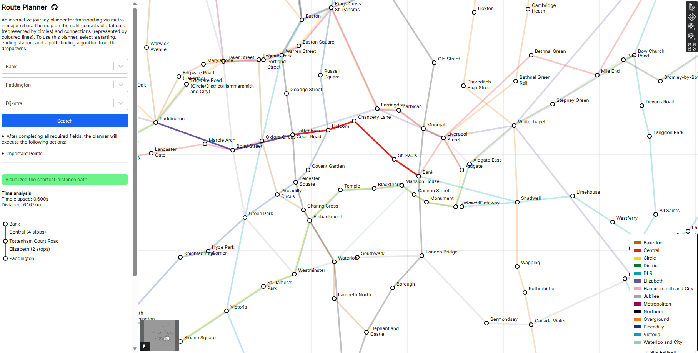

<h1>route-finder</h1>

A dynamic visualization tool designed to identify the most efficient metro routes in major cities. This documentation showcases the essential features of the application and outlines how it adheres to SOLID principles while strategically employing design patterns, offering a comprehensive and insightful overview.

  

<br>



<h2>Table of Contents</h2>

- [Main Features](#main-features)
- [SOLID Principles](#solid-principles)
    - [Single Responsibility Principle](#single-responsibility-principle)
    - [Open-closed Principle](#open-closed-principle)
    - [Liskov Substitution Principle](#liskov-substitution-principle)
    - [Interface Segregation Principle](#interface-segregation-principle)
    - [Dependency Inversion Principle](#dependency-inversion-principle)
- [Design Patterns](#design-patterns)
- [Unit Testing](#unit-testing)
    - [Overview](#overview)
    - [Types of tests available](#types-of-tests-available)
    - [Setting up the testing environment](#setting-up-the-testing-environment)
    - [Running tests](#running-tests)
- [Hosting](#hosting)


## Main Features
- **Automatic parsing** of metro map assets such as stations, interchanges, connections and railway lines.
- **Real-time visualization** of the exploration of various path-finding algorithms on metro maps.


## SOLID Principles
### Single Responsibility Principle
This application follows the single responsibility principle by organizing its components into distinct responsibilities:

1. **Client Code: App.js**
    - `App.js`: Initializes all required utilities and services, and renders the application UI.
2. **Algorithms: Implements various path-finding algorithms**
    - `BaseAlgorithm.js`: A base class with abstract methods for implementing various path-finding algorithms, such as `Dijkstra.js` and `A_star.js`.
3. **React Components**
    - `SearchableDropdown.js`: Responsible for populating and rendering a searchable dropdown list.
4. **Map Assets: Stores key information which is used for exploration and asset rendering**
    - `Station.js`: Stores key information and methods for metro stations.
    - `Connection.js`: Stores key information and methods for metro connections.
    - `MapCanvas.js`: Renders a SVG representation of the metro map, including all metro map assets.
    - `MapGraph.js`: An adjacency list representing a graph of all metro stations in a network. Path-finding algorithms interact with this class to find shortest-distance paths.
5. **Parsers: A collection of parsers to transform raw data into suitable objects**
    All parsers classes should be stored in the `utilities/parsers` directory.
    - `csv_parsers`: A family of CSV parsers that extract data from metro map asset files (see [here](#design-patterns) for details).
    - `path_parsers/TravelPathParser.js`: Transforms a series of `Stations` (representing a travel path between a starting and ending station) into segments to indicate potential transits between metro lines.
6. **Services: A collection of helper classes to maintain code modularity**
    All services classes should be stored in the `utilities/services` directory.
    - `AlgorithmSearchService.js`: Executes path-finding algorithms and returns their results.
    - `SearchHandler.js`: Runs `AlgorithmSearchService` with user-provided parameters and returns corresponding results for visualization.
    - `MetroMapAssetsManager.js`: A central location to initialise and manage the states of all metro map assets.
    - `geographic_services` and subclasses: Handles geographic calculations.


### Open-closed Principle
1. The `AlgorithmSearchService` class can be extended to facilitate new algorithms without modifying its existing code.


### Liskov Substitution Principle
The following are all classes that have a parent-child relationship via extension:
1. `BaseAlgorithm.js` can be extended to implement concrete path-finding algorithms. For example, `Dijkstra.js` and `A_star.js` extend `BaseAlgorithm.js` and override its abstract methods. This allows such subclasses to be substituted for their base class without affecting the correctness of the application logic.
2. `GeographicUtilities.js` can be extended to implement specific geographic calculations for various assets. For example, `StationGeographicUtilities.js` extends the `GeographicUtilities` class in `GeographicUtilities.js` and overrides the `geographicToCartesianCoordinates` and `calculateDistance` methods to adapt to the design of `Station` objects.


### Interface Segregation Principle
1. The `BaseAlgorithm.js` class acts as an interface which provides all methods required to build a path-finding algorithm, *but an algorithm can be implemented without using all these methods*. For example, the `calculateHeuristic` method is declared in the `BaseAlgorithm.js` class, but is only used in the `A_star.js` algorithm, and not the `Dijkstra.js` algorithm. Therefore, this adheres to the ISP.


### Dependency Inversion Principle
1. The `App` component relies on various services, and the dependencies are injected via constructor parameters.
2. These classes also follow the DIP, as dependencies are injected or accessed through abstractions:
    - `AlgorithmSearchService.js`
    - `DebuggerHandler.js`
    - `MetroMapAssetsManager.js`
    - `SearchHandler.js`


## Design Patterns
I applied sesveral design patterns in this project to improve code quality and scalability. Ultimately, this enables me to develop more efficient, modular, and adaptable software systems.

1. **Strategy**: The data for this project is stored in 3 separate `.csv` files (`connections.csv`, `railways.csv` and `stations.csv`). Every row of data in each file is extracted in the same manner *but should be parsed differently*, thus I created `BaseCSVParser` to encapsulate the parsing behaviour, where concrete implementations such as `StationsCSVParser` provides the specific implementation for parsing stations.
    <br>

    <details>
    <summary>BaseCSVParser.js</summary>

    ```
    class BaseCSVParser {
        constructor(filePath) {
            this.filePath = filePath;
        }

        async parse() {
            // All CSV parsers split their CSV files into rows by the \n symbol.
            const response = await fetch(this.filePath);
            const csvText = await response.text();
            const csvData = csvText.split(/\r\n|\n/).filter(Boolean);
            return csvData;
        }
    }

    export default BaseCSVParser;
    ```

    </details>
   
    <details>
    <summary>StationsCSVParser.js</summary>

    ```
    class StationsCSVParser extends BaseCSVParser {
        async parse(stations) {
            // @params stations (hashmap): Stores all Station objects that are previously
            // initialized by a StationsCSVParser instance, with the station name as the 
            // keys, and Station objects as the values.

            const csvData = await super.parse();    // The base parse method splits rows by the \n symbol.

            csvData.forEach(row => {
                const [stationName, latitude, longitude] = row.split(",");
                stations[stationName] = new Station(stationName, latitude, longitude);
            });
        
            console.log("All " + Object.entries(stations).length + " stations parsed.");
            return stations;
        }
    }


    export default StationsCSVParser;
    ```
    
    </details>
    <br>

2. **Factory**: Extending the above use case, I created a common interface (`CSVParserFactory`) to create different CSV parseres based on the type of data to be parsed (railways, stations or connections CSV files). Each specific parser can then handle the details of parsing that particular type of data. This allows me to encapsulate the object creation logic in the factory, and the application code doesn't need to worry about which parser to instantiate.
   <br>
   <details>
    <summary>CSVParserFactory.js</summary>
    
    ```
    class CSVParserFactory {
        createParser(type, filePath) {
            switch (type) {
                case 'stations':
                    return new StationsCSVParser(filePath);
                case 'connections':
                    return new ConnectionsCSVParser(filePath);
                // Add more cases for other types if needed
                default:
                    throw new Error('Invalid parser type');
            }
        }
    }
    ```

   </details>


## Unit Testing
This section provides information on setting up the testing environment, running tests, and writing different types of tests to ensure the reliability and stability of the application.


### Overview
Unit tests are written with the `Jest` testing framework. The application currently contains 73 unit tests across 19 test suites with 85.13% code coverage.


### Types of tests available
Currently the application consists of only unit tests. These tests focus on testing individual functions, components, or modules in isolation. They help ensure that each part of the application works as expected.


### Setting up the testing environment
To set up the testing environment for this React.js project, follow these steps:
- Install Node.js: Ensure that Node.js is installed on your machine. You can download it from https://nodejs.org/. 
- Install project dependencies: Run the following command in the project root directory to install the required dependencies:
    ```
    npm install
    ```

### Running tests
To run all unit tests for the application, follow these steps:
1. Ensure that you are in the project directory:
    ```
    cd app
    ```
    At this level, you should see the `src` directory.

2. Run tests
    - for development: `npm test`
    - for code coverage: `npm run test -- --coverage --watchAll=false`


## Hosting
This project is hosted via GitHub pages. To deploy this application for production, see the following steps:
1. Install the [GitHub Pages package](https://www.npmjs.com/package/gh-pages) as a dev-depedency:
    ```
    cd app
    npm install gh-pages --save-dev
    ```
2. Add properties to the `package.json` file:
    - Add a `homepage` field at the top level:
        ```
        "homepage": "http://{github-username}.github.io/{repo-name}"
        ```
        For example, "http://jhtkoo0426.github.io/route-finder".
    - In the `scripts` field (also at the top level), add the following:
        ```
        "scripts": {
            // ...
            "predeploy": "npm run build",
            "deploy": "gh-pages -d build"
        }
        ```
        These commands make the deployment process more straightforward.
3. Run the following command to deploy the app:
    ```
    npm run deploy
    ```
    Note: Remember to checkout to the specific branch where you want to deploy your app.
    
Once you have completed the initial deployment steps for your app, you can resume the process from step 3 during subsequent deployment attempts.
